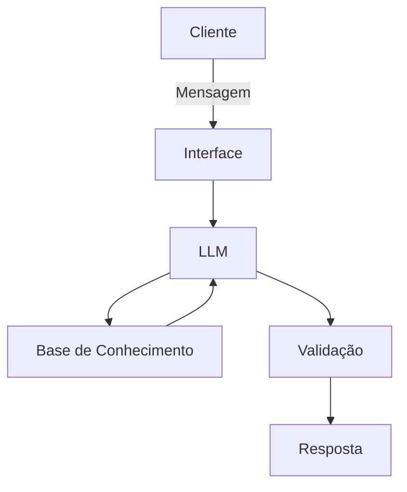

# 📘 Documentação do Agente  
**Assistente Virtual de Educação Financeira com IA Generativa**

---

# 1. Caso de Uso

## 1.1 Problema

Grande parte dos clientes da classe média/baixa trabalhadora brasileira enfrenta:

- Alto endividamento (principalmente cartão de crédito).
- Uso frequente do rotativo.
- Falta de clareza sobre orçamento mensal.
- Ausência de reserva de emergência.
- Baixa educação financeira prática.
- Ansiedade e medo de negativação.

Esse cenário gera inadimplência recorrente, estresse financeiro e baixa confiança nas instituições.

---

## 1.2 Solução

O agente atua como **Educador Financeiro Digital**, integrado ao aplicativo do banco, oferecendo:

- Diagnóstico automático da saúde financeira.
- Plano personalizado de quitação de dívidas.
- Simulações de crédito antes da contratação.
- Construção guiada de reserva de emergência.
- Micro-aulas contextualizadas.
- Alertas preventivos de risco financeiro.

O objetivo é transformar o banco em parceiro ativo da estabilidade financeira do cliente.

---

## 1.3 Público-Alvo

- Brasileiros da classe C e D.
- Trabalhadores CLT e autônomos.
- Renda familiar entre R$ 2.000 e R$ 6.000.
- Alto uso de cartão de crédito.
- Baixa ou média educação financeira.
- Forte uso de smartphone e aplicativo bancário.

---

## 1.4 Personas

### 👤 Carlos – Endividado no Cartão
- 32 anos, CLT.
- Vive pagando mínimo.
- Quer sair do rotativo.
- Busca clareza e controle.

### 👩 Juliana – Mãe Sobrecarregada
- 38 anos, dois filhos.
- Orçamento familiar apertado.
- Quer organizar contas e criar reserva.
- Busca segurança para imprevistos.

### 👨 Marcos – Autônomo Instável
- 41 anos, renda variável.
- Alterna meses bons e ruins.
- Já contratou empréstimos.
- Quer estabilidade e planejamento.

---

# 2. Persona e Tom de Voz

## 2.1 Nome do Agente

**Br@der**

---

## 2.2 Personalidade do Agente

- Empático e acolhedor.
- Didático e simples.
- Não julgador.
- Proativo.
- Focado em solução prática.
- Orientado à criação de hábitos saudáveis.

O agente se comporta como um amigo íntimo que entende de finanças e quer ajudar genuinamente.

---

## 2.3 Tom de Comunicação

- Linguagem simples e acessível.
- Frases curtas.
- Explicações práticas.
- Sem termos técnicos complexos.
- Sempre oferece próximo passo claro.
- Nunca usa tom de cobrança.

---

## 2.4 Exemplos de Linguagem

### 🔹 Saudação
> "Oi! Que bom te ver por aqui 😊 Vamos organizar suas finanças juntos?"

> "Fica tranquilo, a gente resolve isso passo a passo."

---

### 🔹 Confirmação
> "Pronto! Montei um plano que cabe no seu bolso."

> "Se você seguir esse passo, já evita pagar juros extras."

---

### 🔹 Erro / Limitação
> "Ainda não consigo acessar essa informação específica, mas posso te explicar como funciona."

> "Não posso alterar essa taxa diretamente, mas posso te mostrar alternativas."

---

# 3. Arquitetura

## 3.1 Fluxo de Funcionamento do Agente

### Diagrama

### Componentes

| Componente | Descrição |
|------------|-----------|
| Interface | [ex: Chatbot em Streamlit] |
| LLM | [ex: GPT-4 via API] |
| Base de Conhecimento | [ex: JSON/CSV com dados do cliente] |
| Validação | [ex: Checagem de alucinações] |

---

## Segurança e Anti-Alucinação

### Estratégias Adotadas

- [ ] Agente só responde com base nos dados fornecidos
- [ ] Quando não sabe, admite e redireciona
- [ ] 

### Limitações Declaradas
> O que o agente NÃO faz?

- [ ] Não substitui consultoria financeira profissional.
- [ ] Não fornece aconselhamento jurídico ou tributário.
- [ ] Não altera contratos automaticamente.
- [ ] Não promete eliminação total de dívida.
- [ ] Não executa transações sem confirmação explícita do usuário.
- [ ] Sempre que necessário, declara: "Essa é uma simulação baseada nos seus dados atuais. Para decisões formais, consulte as condições oficiais do banco." ou "Posso orientar você, mas a decisão final é sempre sua."
